# When immediate imitation is not enough

[DAgger](https://arxiv.org/abs/1011.0686) fixes the classic failure of behavior cloning by training on the states the
learner actually visits: roll out the learner, ask the expert what it would do at each visited state, and fit those
labels with supervised learning. But the target it fits is still *local*: at each state, put probability on the
expert's action now.

That is the right target when the learner can imitate the expert perfectly. Often it can't, for one of three reasons:

- **Privileged information.** The expert sees something the learner doesn't, such as a hidden goal or the true state.
- **A hard-to-imitate expert.** In some states, nothing the learner can observe predicts what the expert will do.
- **Limited capacity.** The learner sees everything but is too small to represent the expert, as when a large model is
  distilled into a small one.

Then some mistakes are unavoidable, and the question becomes **which** mistakes to make. DAgger's per-step loss charges
every mistake the same. This post compares it with the simplest long-horizon alternative, which I'll call
**Agreement PPO**: run PPO on the learner's own roll-outs with a reward of $+1$ when the learner's action matches the
expert's and $-1$ when it doesn't, and credit each action with the return, the agreement the learner goes on to achieve.
It uses exactly the labels DAgger uses. Only the credit assignment differs.

For each of the three reasons, I built the smallest environment I could find where that difference is all there is:

<figure>
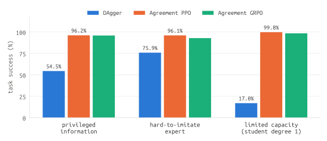
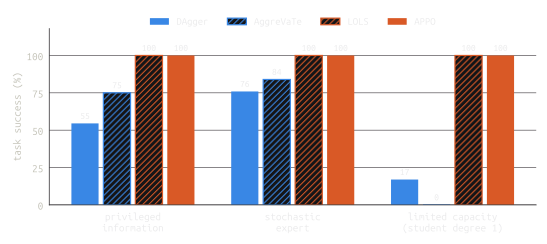
<figcaption>Figure 1. Task success, meaning at most 2 disagreements with the expert in a 9-step episode (a metric no method trains on), in the three settings. Mean over 12 seeds. For limited capacity the student is a degree-1 polynomial; Figure 8 covers every size.</figcaption>
</figure>

*Table 1. Where DAgger falls short in each setting, and what Agreement PPO does instead.*

| Setting | DAgger's limitation | What Agreement PPO does |
|---|---|---|
| Privileged information | Two first actions match the expert equally often, but only one reveals the information needed to imitate it later. DAgger is exactly indifferent. | Takes the revealing action (probability 0.99). |
| Hard-to-imitate expert | Two first mistakes are equally likely, but only one leads to states where the expert is unpredictable. DAgger is exactly indifferent. | Makes the recoverable mistake (0.97). |
| Limited capacity | The teacher's own path leads to behavior the student can't fit. DAgger always follows the teacher. | Leaves the teacher's path at the first step (0.998), for one it can follow. |

In all three, [AggreVaTe](https://arxiv.org/abs/1406.5979), which looks ahead with the expert's cost-to-go, makes the
same choice as DAgger. What changes the choice is crediting an action with the agreement the *learner* goes on to
achieve. The
advantage has limits, also shown below: where imitation is possible, supervised labels learn it faster and better, and
when the teacher is a distribution, Agreement PPO chases its most likely action rather than matching it.

The phenomenon isn't new: with privileged information it is the *imitation gap*
([Weihs et al., 2021](https://arxiv.org/abs/2007.12173)). Neither is the idea of fixing it with returns: crediting a
learner with the expert agreement it goes on to achieve has close relatives in structured prediction, privileged-expert RL
and LLM distillation (see [Related work](#related-work)). I haven't found this exact algorithm studied as an imitation
method, but small differences in the reward or the optimizer can change behavior a lot, so the closest ones are listed
there with how they differ. What the toys add is constructions clean enough to derive DAgger's behavior exactly and check
it against the runs. All code is at
[github.com/khanhptnk/future-aware-imitation](https://github.com/khanhptnk/future-aware-imitation) and runs on a CPU in
a few minutes.

## Two ways to use the same labels

Both methods roll out the learner and ask the expert for its action $a^*_t$ at every state the learner visits.

- **DAgger** fits those labels with supervised learning: at each visited state, raise the probability of the expert's
  action. Labels are aggregated over iterations and the policy is refit each time.
- **Agreement PPO** turns each label into a reward, $r_t = +1$ if $a_t = a^*_t$ and $r_t = -1$ otherwise, and maximizes
  the undiscounted return

  $$
  J(\pi) = \mathbb{E}_{\tau \sim \pi}\Big[\sum_{t=0}^{8} r_t\Big]
  $$

  with PPO's clipped objective. Each action is credited with its return-to-go: the agreement the learner itself achieves
  from that step on.
- **Agreement GRPO** uses the same reward with a minimal GRPO-style update: a trajectory's total agreement, normalized
  within a group of trajectories, is the advantage of every action in it.

$J$ is the expected number of agreements minus disagreements, which makes it an affine function of the objective DAgger
itself is designed to approximate (see [Related work](#related-work)). DAgger approaches it through per-step supervised
fits that treat the learner's state distribution as fixed, and that is exactly what keeps it from seeing where its
actions lead.

Every environment below has 9 binary decisions: a first decision at a *root*, then 8 steps whose situation depends on
the root action. The root always has its own parameter, so nothing learned later can leak into the root decision through
shared parameters; the root is decided by the training signal alone. Every number is a mean over 12 training seeds.

## Case 1: privileged information

<figure>
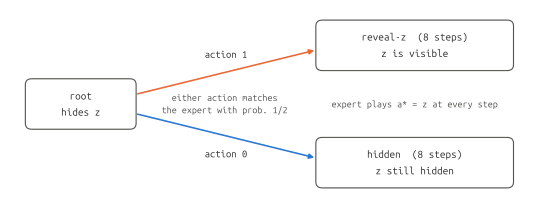
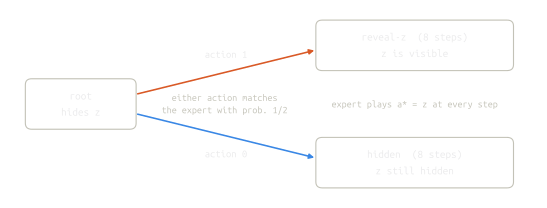
<figcaption>Figure 2. The privileged-information environment. As far as immediate imitation goes, the root action is a coin flip, but only action 1 makes the rest of the episode imitable.</figcaption>
</figure>

**Setup.** Each episode samples a hidden bit $z \sim \mathrm{Bernoulli}(0.5)$. The expert sees $z$ and plays $a^*_t = z$
at every step. The learner doesn't see $z$ at the root, so whatever it does there, it matches the expert with
probability $\tfrac{1}{2}$. Its later observations depend only on its root action. After action 1 they reveal $z$ (two
observations, one per value of $z$); after action 0 they are a single observation that still hides $z$. The policy is
tabular: one Bernoulli parameter per observation, four in total.

**Where DAgger falls short.** At the root the expert's label is $z$, which is 0 half the time and 1 half the time,
whatever the learner does. DAgger's cross-entropy at the root is therefore

$$
\mathcal{L}_{\mathrm{root}}(\pi) = -\tfrac{1}{2}\log \pi(0 \mid o_{\mathrm{root}}) - \tfrac{1}{2}\log \pi(1 \mid o_{\mathrm{root}}),
$$

minimized at $\pi(1 \mid o_{\mathrm{root}}) = \tfrac{1}{2}$. DAgger learns the later observations perfectly: after action
1 it reads $z$ off the observation and copies it, and after action 0 its labels are again a 50/50 mix. But none of that
reaches the root. Every episode, DAgger flips a fair coin between a future it can imitate and one it can't.

> [!claim]
> When the learner can't infer the expert's action, the local imitation target at a state is the expert's action
> distribution given what the learner sees there. It contains no information about which action leads to states where
> the expert *can* be inferred.

Looking ahead with the expert doesn't help either. AggreVaTe replaces the label with a cost-to-go: at a visited state,
try an action, let the **expert** finish the episode, and prefer the action with the better total. Here the expert sees
$z$, so it agrees with itself at every remaining step whichever root action came first. The total is $\pm 1$ for the
root step plus 8 afterwards for either action, and averaged over $z$ the two actions tie. Rolling out the expert assumes
the expert will be around to recover. The learner won't be: after action 0 it has no way to know $z$.

**What Agreement PPO does.** It scores each root action by the agreement the learner itself goes on to achieve: up to 8
after action 1 (it can copy $z$) and 0 in expectation after action 0 (it can do no better than a coin flip at each of 8
steps). The gap is the whole rest of the episode.

**Results.**

*Table 2. Privileged information (mean ± standard deviation over 12 seeds; 50,000 evaluation episodes each). The best
possible policy, always reveal and then copy $z$, has a return of 8, 0.5 errors and 100% success.*

| Method | P(revealing action) | Signed return | Errors / episode | Task success |
|---|---|---|---|---|
| DAgger | 0.500 ± 0.002 | 4.00 ± 0.02 | 2.50 ± 0.01 | 54.5% ± 0.2% |
| Agreement PPO | 0.986 ± 0.000 | 7.19 ± 0.01 | 0.90 ± 0.00 | 96.2% ± 0.1% |
| Agreement GRPO | 0.967 ± 0.001 | 7.01 ± 0.01 | 0.99 ± 0.01 | 96.0% ± 0.1% |

DAgger lands exactly where the analysis puts it. Half its episodes take the revealing branch and succeed. The other
half are 9 coin flips, which succeed with probability $P(\mathrm{Bin}(9, \tfrac{1}{2}) \le 2) = 46/512$, so its success
rate is $\tfrac{1}{2} + \tfrac{1}{2} \cdot \tfrac{46}{512} = 54.49\%$. Agreement PPO and GRPO learn to reveal:

<figure>
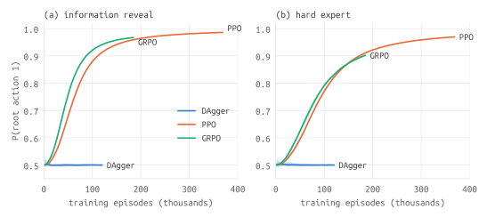
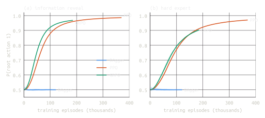
<figcaption>Figure 3. The root decision during training (mean and range over 12 seeds). The x-axis counts episodes, so methods with smaller batches end earlier. DAgger's root never moves from 1/2.</figcaption>
</figure>

Success moves much more than the average error count, because the two root choices give very different error
**distributions**:

<figure>
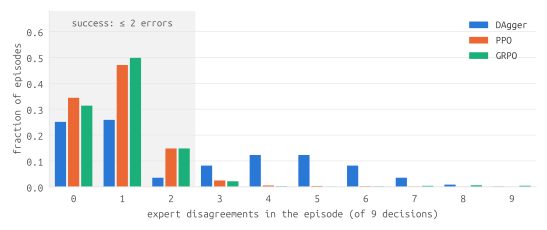
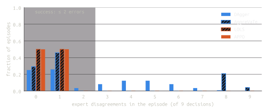
<figcaption>Figure 4. Errors per episode with privileged information, computed exactly from each trained policy (averaged over seeds). DAgger's hidden-branch episodes form the second hump.</figcaption>
</figure>

## Case 2: a hard-to-imitate expert

<figure>
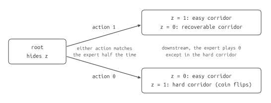
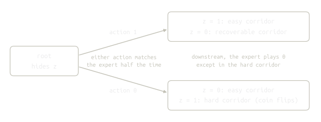
<figcaption>Figure 5. The hard-to-imitate-expert environment. Both root actions are wrong half the time, but only action 0's mistake leads to an expert nobody can predict.</figcaption>
</figure>

**Setup.** The root is the same as in case 1: the expert plays the hidden bit $z$, and the learner can't see it. What
differs is where mistakes lead. A correct root action enters an easy corridor. The mistake "1 when $z = 0$" enters a
recoverable corridor, and the mistake "0 when $z = 1$" a hard corridor. In the easy and recoverable corridors the expert
always plays 0; in the hard corridor it flips a fresh coin at every step. The learner sees which corridor it is in, so it
isn't missing information afterwards. In the hard corridor nothing it could observe would help: no one can predict a
coin flip. This construction is more artificial than case 1, because the asymmetry is put into the expert directly.

**Where DAgger falls short.** At the root the label is again $z$, so DAgger's root target is again exactly
$\tfrac{1}{2}$. It learns the easy and recoverable corridors perfectly and plays $\tfrac{1}{2}$ in the hard one. In the
quarter of episodes where $z = 1$ and it plays 0, it spends 8 steps flipping coins against the expert's coins. Its exact
success rate is $\tfrac{1}{2} + \tfrac{1}{4} + \tfrac{1}{4} \cdot P(\mathrm{Bin}(8, \tfrac{1}{2}) \le 1) = 75.88\%$.
AggreVaTe ties too: an expert finishing the episode agrees with itself, coin flips included, in every corridor.

**What Agreement PPO does.** After action 1, the learner can imitate the expert for the rest of the episode in either
corridor it may enter: 8 more agreements. After action 0, it can when $z = 0$, but when $z = 1$ its expected agreement
in the hard corridor is 0. So action 1 is worth 4 more agreements on average, and Agreement PPO learns to make the
recoverable mistake.

**Results.**

*Table 3. Hard-to-imitate expert, 12 seeds. P(root action 1) is the probability of choosing the side whose mistake is
recoverable.*

| Method | P(root action 1) | Signed return | Errors / episode | Task success |
|---|---|---|---|---|
| DAgger | 0.500 ± 0.001 | 6.00 ± 0.02 | 1.50 ± 0.01 | 75.9% ± 0.3% |
| Agreement PPO | 0.970 ± 0.001 | 7.18 ± 0.01 | 0.91 ± 0.00 | 96.1% ± 0.1% |
| Agreement GRPO | 0.902 ± 0.003 | 6.83 ± 0.02 | 1.09 ± 0.01 | 92.9% ± 0.2% |

<figure>
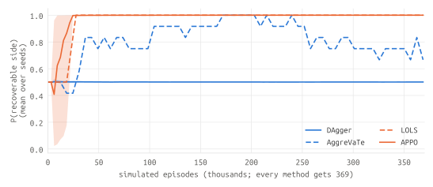
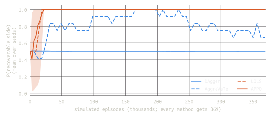
<figcaption>Figure 6. The root decision during training with a hard-to-imitate expert (mean and range over 12 seeds).</figcaption>
</figure>

## Case 3: limited capacity (distillation)

<figure>
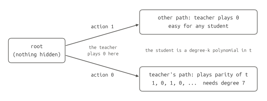
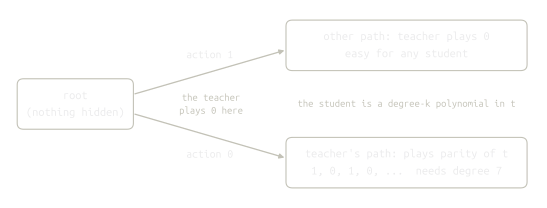
<figcaption>Figure 7. The limited-capacity environment. Copying the teacher's first action leads to behavior a small student can't fit; deviating once leads to behavior any student can.</figcaption>
</figure>

**Setup.** No information is hidden: the student sees exactly what the teacher sees and is simply smaller. The episode is
a root decision followed by 8 steps in one of two branches, chosen by the root action, and the student observes the
branch and the step $t$. The teacher plays 0 at the root, so its own path is branch 0, where it plays the parity of $t$
($1, 0, 1, 0, \dots$). In branch 1 it always plays 0. The student has its own logit at the root and, in each branch, a
logistic policy whose logit is a polynomial of degree $k$ in $t$. Degree 7 is enough to fit the parity of 8 steps, so a
student with $k = 7$ can imitate the teacher perfectly. A polynomial of degree $k$ changes sign at most $k$ times, so on
the teacher's path a smaller student makes at least $\lceil (7 - k)/2 \rceil$ errors. Leaving the teacher's path costs
exactly one error, and branch 1 is easy at any size.

**Where DAgger falls short.** DAgger's label at the root is always 0, so it always follows the teacher, at every student
size; this is exact. AggreVaTe follows too: the teacher's cost-to-go assumes the teacher finishes the episode, and the
teacher imitates itself perfectly in either branch, so copying the root action wins.

**What Agreement PPO does.** For a degree-1 student, following the teacher is worth a return of at most $1 + (5 - 3) = 3$
(at least 3 errors in branch 0), and leaving is worth $-1 + 8 = 7$. Agreement PPO learns to leave.

**Results.**

*Table 4. Limited capacity with a deterministic teacher (12 seeds; standard deviations across seeds are at most 0.01,
or 0.2 points of success).
"Leave" is the probability of leaving the teacher's path at the root. A degree-7 student can represent the teacher.*

| Student | Method | Leave | Signed return | Errors / episode | Task success |
|---|---|---|---|---|---|
| degree 1 | DAgger | 0.000 | 1.37 | 3.82 | 17.0% |
| degree 1 | Agreement PPO | 0.998 | 6.98 | 1.01 | 99.8% |
| degree 1 | Agreement GRPO | 0.982 | 6.86 | 1.07 | 98.5% |
| degree 7 | DAgger | 0.000 | 9.00 | 0.00 | 100.0% |
| degree 7 | Agreement PPO | 0.901 | 7.09 | 0.95 | 99.9% |
| degree 7 | Agreement GRPO | 0.969 | 6.93 | 1.04 | 99.4% |

<figure>
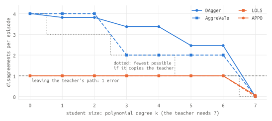
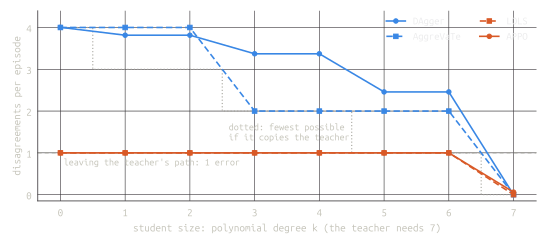
<figcaption>Figure 8. Distillation from a deterministic teacher into students of every size (mean over 12 seeds; seed-to-seed standard deviations are at most 0.01). The dotted steps are the fewest errors a student of that size can make on the teacher's path.</figcaption>
</figure>

- **Below degree 7, DAgger pays for following the teacher:** 2.5 to 4 errors per episode. That is more than the fewest
  possible on the teacher's path, because maximum likelihood on labels the student can't fit gives soft probabilities,
  not the policy with the fewest errors. (Degrees pair up, 1 with 2 and so on, because the teacher's labels at $t$ and
  $9 - t$ are opposite, so even-degree terms don't help.)
- **Agreement PPO and GRPO leave the teacher's path** in 98% to 99.8% of episodes and make about one error per episode,
  at every size below 7.
- **At degree 7 the roles reverse.** DAgger imitates perfectly. Agreement PPO still leaves the teacher's path in 90% of
  episodes (0.95 errors). The other branch is easy to learn, so it commits to that branch early, and from then on it
  rarely visits the teacher's path, so it gets little signal to return.

### With a stochastic teacher

Language-model teachers are distributions, and the standard distillation objectives compare distributions. So make the
teacher put probability 0.9 on the action above in every state, including the root, and 0.1 on the other. Then compare
four ways of training the student on its own roll-outs, with the teacher queried at every state the student visits:

- **On-policy forward KL:** cross-entropy to the teacher's distribution at the student's states, which is DAgger with
  soft labels (GKD's forward KL, and the "DAgger-style on-policy SFT" of my
  [previous post](./kl-penalty-in-grpo)).
- **Reverse KL with a discount of zero:** a per-token reward $\log \pi_T(a \mid s) - \log \pi_S(a \mid s)$, with each token
  credited only with its own reward, as in
  [Thinking Machines' on-policy distillation](https://thinkingmachines.ai/blog/on-policy-distillation/).
- **Reverse KL with returns:** the same reward with undiscounted returns, which follows the gradient of the
  sequence-level reverse KL $\mathrm{KL}(P_S \,\|\, P_T)$ (the first row of Table 1 in the previous post).
- **Agreement PPO:** $+1$ for agreeing with the teacher's preferred action and $-1$ otherwise, as before.

The RL variants share the same update. An episode has only $2 \times 2^8 = 512$ action sequences, so every metric is
computed exactly by summing over all of them.

<figure>

<figcaption>Figure 9. Distillation from a stochastic teacher (mean over 12 seeds). Blue objectives credit each token only with its own score; orange ones use returns. Disagreements are counted against the teacher's preferred action; the teacher itself averages 0.9.</figcaption>
</figure>

*Table 5. Stochastic teacher, student of degree 1 (12 seeds, exact evaluation). "Leave" is the probability of leaving
the teacher's path at the root. Reverse KL is $\mathrm{KL}(P_S \Vert P_T)$ and forward KL is $\mathrm{KL}(P_T \Vert P_S)$,
both over whole episodes, in nats.*

| Objective | Leave | Errors | Success | Rev. KL | Fwd. KL |
|---|---|---|---|---|---|
| Teacher | 0.10 | 0.90 | 94.7% | 0 | 0 |
| Forward KL | 0.100 | 3.64 | 23.1% | 3.49 | 2.54 |
| Reverse KL, γ = 0 | 0.103 | 3.61 | 23.7% | 3.47 | 2.55 |
| Reverse KL, returns | 0.840 | 2.12 | 71.1% | 2.13 | 3.90 |
| Agreement PPO | 0.998 | 1.01 | 99.8% | 3.11 | 14.2 ± 1.8 |

- **Per-token objectives follow the teacher at every student size.** Both leave the teacher's path with the teacher's own
  probability, 0.1. With the root's own parameter, each one's target at the root is to match the teacher there,
  whatever comes after, so the root decision can't see what the student can do downstream.
- **Objectives with returns leave.** Where the optimum of the sequence-level reverse KL can be worked out by hand, reverse
  KL with returns reaches it. For $k = 0$, the student's best policy on the teacher's path is a coin flip, which costs
  $8\,\mathrm{KL}(\mathrm{Bern}(0.5) \,\|\, \mathrm{Bern}(0.9)) = 4.087$ nats. The optimum then leaves with probability
  $0.1 / (0.1 + 0.9\,e^{-4.087}) = 0.869$, at a KL of 2.162 nats; training reaches 0.866 and 2.162.
- **The two optimize different things.** Agreement PPO goes after the teacher's preferred action and collapses to a
  nearly deterministic student: almost no errors, but far from the teacher's distribution (a forward KL of 14 nats, with
  large variation across seeds). Reverse KL with returns stays a distribution and trades errors for KL; it has the
  lowest reverse KL of the four, which is its objective.
- **At degree 7 the per-token objectives win again.** On-policy forward KL matches the teacher exactly, and reverse KL with
  a discount of zero nearly does (0.05 nats). Reverse KL with returns hasn't converged after the same budget (0.54 nats).

## When DAgger is the better choice

Agreement PPO's advantage is specific to choosing among unavoidable mistakes. Elsewhere, the experiments above show its
costs:

- **Where imitation is possible, supervised labels are faster and better.** With privileged information, once $z$ is
  revealed DAgger copies it perfectly from the first few labels. After 370,000 episodes Agreement PPO still disagrees with
  the expert at 4.4% of those steps, 0.35 of its 0.9 errors per episode (0.5 is the unavoidable root coin flip). With a
  degree-7 student, DAgger is perfect and Agreement PPO isn't.
- **It needs more episodes.** DAgger reaches its fixed point well within its 120,000 episodes; Agreement PPO is still
  improving after 370,000 (Figures 3 and 6).
- **It targets the expert's most likely action.** Against a stochastic teacher it collapses to that action and abandons
  the teacher's distribution. If matching the distribution is the goal, the sequence-level reverse KL with returns makes
  the same kind of choice at the root while staying a distribution.

## Related work

- **The objective.** [Ross et al. (2011)](https://arxiv.org/abs/1011.0686) define imitation's goal as minimizing the
  expected per-step loss under the learner's own state distribution. With 0-1 loss over 9 steps, that is the expected
  number of disagreements, an affine function of $J$ here. DAgger gets there through a reduction to no-regret online
  learning, which fits each iteration's data as if that distribution were fixed. Its guarantee is good when some policy
  in the class imitates the expert well on that data, and weak here, where none can.
  [Czarnecki et al. (2019)](https://arxiv.org/abs/1902.02186) make the general version of this point for policy
  distillation: on-policy distillation updates are in general not the gradient of any objective, and adding the future
  distillation loss as a reward recovers the gradient of the cumulative loss.
- **The closest algorithms.** None of these is Agreement PPO, PPO on a $\pm 1$ agreement reward with returns, and each
  difference can matter.
  - [Walsman et al. (2023)](https://openreview.net/forum?id=sciA_xgYofB) study experts with privileged information and
    include an expert-matching reward trained with PPO as a baseline: $\pm 0.1$ per step added to the task reward, with
    a learned critic and $\gamma = 0.99$. They observe that it can learn loops that keep collecting agreement reward,
    which variable-length episodes allow and the fixed horizon here rules out. Their implementation has an entropy bonus
    and doesn't normalize advantages, so $\pm 0.1$ there is not equivalent to $\pm 1$.
  - [Maes et al. (2009)](https://link.springer.com/article/10.1007/s10994-009-5140-8) cast structured prediction as RL
    with a per-decision reward of 1 for a correct label and 0 otherwise, trained with policy-gradient and SARSA methods.
  - [LOLS](https://arxiv.org/abs/1502.02206) with learned roll-outs scores each action by rolling out the learner and
    counting disagreements with the reference, then trains a cost-sensitive classifier rather than a policy gradient.
  - Several methods use a soft agreement score instead of $\pm 1$: similarity to a fully observable teacher
    ([COSIL](https://arxiv.org/abs/2211.01991)), or the teacher's log-probabilities in LLM distillation, optimized with
    returns ([MiniLLM](https://arxiv.org/abs/2306.08543), [γOPD](https://arxiv.org/abs/2609.16937)) or with a discount
    of zero, each token scored only for itself
    ([Thinking Machines](https://thinkingmachines.ai/blog/on-policy-distillation/)). The soft score is a real difference:
    against a deterministic expert like the ones here, the teacher's log-probability is $-\infty$ for every mistake, so
    it can't rank mistakes at all.
  - Further away: [DeepMimic](https://arxiv.org/abs/1804.02717) trains with PPO on a reward for tracking a reference
    motion's states, and [SQIL](https://arxiv.org/abs/1905.11108) rewards demonstrated transitions from a fixed dataset
    rather than querying an expert.
- **The imitation gap.** [Weihs et al. (2021)](https://arxiv.org/abs/2007.12173) name it: when the expert has privileged
  information, imitation converges to the expert's actions averaged over what the learner can't see, which can be far
  from the best policy the learner could execute. Their ADVISOR method weights imitation and RL losses state by state,
  depending on how well the learner can imitate there. [Warrington et al. (2021)](https://arxiv.org/abs/2012.15566)
  adapt the expert itself toward what the learner can follow. [Swamy et al. (2022)](https://arxiv.org/abs/2208.02225) study
  imitation when the expert acts on a context the learner doesn't observe, and show why on-policy training matters there.
- **Roll-out policies in learning to search.** [SEARN](https://arxiv.org/abs/0907.0786),
  [AggreVaTe](https://arxiv.org/abs/1406.5979) and [AggreVaTeD](https://arxiv.org/abs/1703.01030) assign each action a
  cost-to-go estimated by rolling out a reference or the learner. [LOLS](https://arxiv.org/abs/1502.02206) analyzes
  the choice between rolling out the reference and rolling out the learned policy, and shows that rolling out only the
  reference can do poorly when the reference is suboptimal. AggreVaTe's choices above are cousins of that failure: the
  reference is optimal, but the learner can't follow it.

What the toys add is constructions where the effect has nowhere else to come from: the root has its own parameter, the
expert's rule is fixed, and DAgger's behavior at the root (and AggreVaTe's) is exact rather than empirical.

## What to take away

- **A local imitation loss can't rank unavoidable mistakes.** With privileged information or a hard-to-imitate expert,
  two actions equally likely to match the expert get the same target, however different their consequences. With
  limited capacity, the target follows the teacher even into behavior the student can't fit.
- **Whose future gets scored is what matters.** Crediting an action with how well the learner goes on to imitate
  (agreement in Agreement PPO, the teacher's log-probabilities in the sequence-level reverse KL with returns) breaks the
  tie and leaves an unfollowable path.
  Crediting it with the expert's future (AggreVaTe) or with nothing beyond the current step (DAgger, on-policy forward
  KL, reverse KL with a discount of zero) doesn't.
- **This doesn't make RL a better imitation learner in general.** When imitation is possible, supervised labels are more
  direct and sample-efficient. The point is a regime: the long-horizon objective carries information the immediate label
  doesn't have.

## Setup details

- **Training reward:** $\pm 1$ per step for expert agreement, undiscounted. **Success:** at most 2 disagreements in
  9 steps, used only for evaluation.
- **DAgger:** 40 iterations × 3,000 learner roll-outs. Expert labels at every visited state are aggregated over all
  iterations and the policy is their label frequencies (pseudocount $10^{-3}$).
- **Agreement PPO:** 120 iterations × 3,072 episodes. Advantage: reward-to-go minus the batch-mean reward-to-go at the
  same observation, divided by the global standard deviation; no value network. Clipped surrogate ($\epsilon = 0.2$),
  4 full-batch epochs of gradient ascent with learning rate 0.065. Each observation's logit takes the mean gradient over
  the samples at that observation.
- **Agreement GRPO:** 120 iterations × 192 groups of 8 trajectories (sharing $z$ in cases 1 and 2). Each trajectory's total return is
  normalized within its group and used as the advantage of all its actions; the same clipped update. No KL term or
  reference policy.
- **Limited capacity:** the student's features are Legendre polynomials of $t$ rescaled to $[-1, 1]$, one set per
  branch, plus a root logit. DAgger and on-policy forward KL refit the student to the aggregated labels exactly (by
  Newton's method), with the same pseudocount. The RL variants use the Agreement PPO settings; each state's logit takes
  the mean gradient over its samples, then the chain rule through the features.
- **Seeds:** 0–11 for training; evaluation on 50,000 episodes from `default_rng(9000 + seed)`, except with the
  stochastic teacher, where evaluation is exact.

## Limitations

These are hand-built environments with policies of a few parameters. They show a mechanism, not a practical advantage.
In each one, the choice that matters is a single first decision, and the environment marks out which branch is
imitable; in a real task, or a language model, the futures a learner can follow are not marked out in advance. The
success threshold is arbitrary: it is never used for training, but changing it changes the absolute numbers. Agreement
PPO and GRPO see different numbers of episodes per iteration, so compare each with DAgger, not with each other. The
natural next steps are an environment where actions change what the learner can observe without being designed to,
such as an agent that can choose to look before it acts, and a method that keeps supervised labels where imitation is
possible and uses returns only to choose among unavoidable mistakes.

## References

- Stéphane Ross, Geoffrey J. Gordon and J. Andrew Bagnell, [A Reduction of Imitation Learning and Structured Prediction to No-Regret Online Learning](https://arxiv.org/abs/1011.0686), AISTATS 2011. (DAgger)
- Stéphane Ross and J. Andrew Bagnell, [Reinforcement and Imitation Learning via Interactive No-Regret Learning](https://arxiv.org/abs/1406.5979), 2014. (AggreVaTe)
- Wen Sun, Arun Venkatraman, Geoffrey J. Gordon, Byron Boots and J. Andrew Bagnell, [Deeply AggreVaTeD: Differentiable Imitation Learning for Sequential Prediction](https://arxiv.org/abs/1703.01030), ICML 2017.
- Hal Daumé III, John Langford and Daniel Marcu, [Search-based Structured Prediction](https://arxiv.org/abs/0907.0786), Machine Learning, 2009. (SEARN)
- Kai-Wei Chang, Akshay Krishnamurthy, Alekh Agarwal, Hal Daumé III and John Langford, [Learning to Search Better Than Your Teacher](https://arxiv.org/abs/1502.02206), ICML 2015. (LOLS)
- Luca Weihs, Unnat Jain, Iou-Jen Liu, Jordi Salvador, Svetlana Lazebnik, Aniruddha Kembhavi and Alexander Schwing, [Bridging the Imitation Gap by Adaptive Insubordination](https://arxiv.org/abs/2007.12173), NeurIPS 2021.
- Andrew Warrington, J. Wilder Lavington, Adam Ścibior, Mark Schmidt and Frank Wood, [Robust Asymmetric Learning in POMDPs](https://arxiv.org/abs/2012.15566), ICML 2021.
- Gokul Swamy, Sanjiban Choudhury, J. Andrew Bagnell and Zhiwei Steven Wu, [Sequence Model Imitation Learning with Unobserved Contexts](https://arxiv.org/abs/2208.02225), NeurIPS 2022.
- Francis Maes, Ludovic Denoyer and Patrick Gallinari, [Structured prediction with reinforcement learning](https://link.springer.com/article/10.1007/s10994-009-5140-8), Machine Learning, 2009.
- Wojciech M. Czarnecki, Razvan Pascanu, Simon Osindero, Siddhant M. Jayakumar, Grzegorz Swirszcz and Max Jaderberg, [Distilling Policy Distillation](https://arxiv.org/abs/1902.02186), AISTATS 2019.
- Aaron Walsman, Muru Zhang, Sanjiban Choudhury, Dieter Fox and Ali Farhadi, [Impossibly Good Experts and How to Follow Them](https://openreview.net/forum?id=sciA_xgYofB), ICLR 2023.
- Hai Nguyen, Andrea Baisero, Dian Wang, Christopher Amato and Robert Platt, [Leveraging Fully Observable Policies for Learning under Partial Observability](https://arxiv.org/abs/2211.01991), CoRL 2022.
- Shiqi Liu et al., [Beyond Token-Local Imitation: Reward-Compatible Temporal Credit Assignment for On-Policy Distillation](https://arxiv.org/abs/2609.16937), 2026. (γOPD)
- Thinking Machines Lab, [On-Policy Distillation](https://thinkingmachines.ai/blog/on-policy-distillation/), 2025.
- Yuxian Gu, Li Dong, Furu Wei and Minlie Huang, [MiniLLM: On-Policy Distillation of Large Language Models](https://arxiv.org/abs/2306.08543), ICLR 2024.
- Xue Bin Peng, Pieter Abbeel, Sergey Levine and Michiel van de Panne, [DeepMimic: Example-Guided Deep Reinforcement Learning of Physics-Based Character Skills](https://arxiv.org/abs/1804.02717), SIGGRAPH 2018.
- Siddharth Reddy, Anca D. Dragan and Sergey Levine, [SQIL: Imitation Learning via Reinforcement Learning with Sparse Rewards](https://arxiv.org/abs/1905.11108), ICLR 2020.
- John Schulman, Filip Wolski, Prafulla Dhariwal, Alec Radford and Oleg Klimov, [Proximal Policy Optimization Algorithms](https://arxiv.org/abs/1707.06347), 2017.
- Zhihong Shao et al., [DeepSeekMath: Pushing the Limits of Mathematical Reasoning in Open Language Models](https://arxiv.org/abs/2402.03300), 2024. (GRPO)
- Code: [github.com/khanhptnk/future-aware-imitation](https://github.com/khanhptnk/future-aware-imitation).
