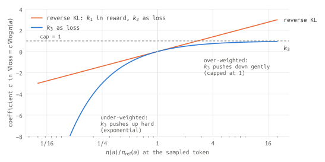
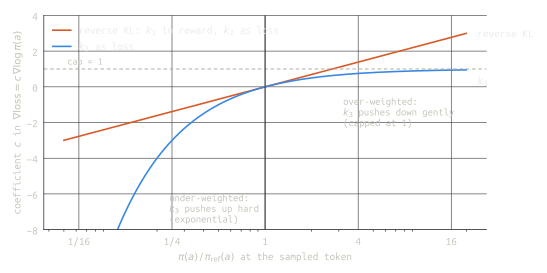
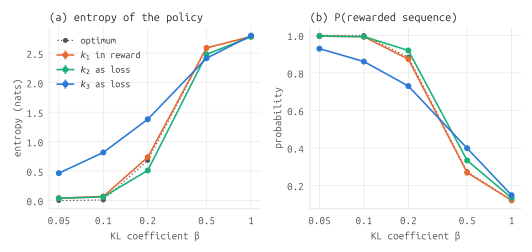
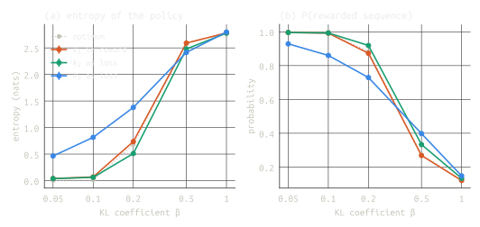
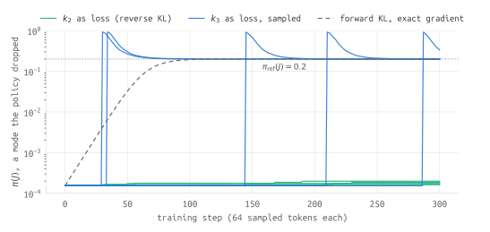
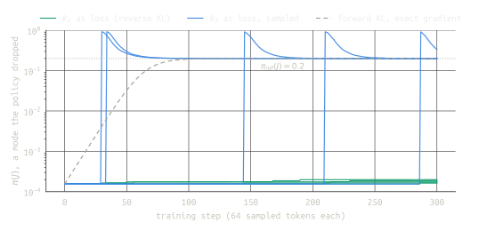

# GRPO's KL penalty pulls toward the forward KL

RL fine-tuning of language models usually keeps the policy $\pi_\theta$ close to a reference model $\pi_{\mathrm{ref}}$ with a
KL penalty. The objective says *reverse* KL, $\mathrm{KL}(\pi_\theta \,\|\, \pi_{\mathrm{ref}})$. But how the penalty is
implemented decides which gradient you actually get. The popular choice in GRPO, adding the $k_3$ estimator to the loss and
backpropagating through it, follows the gradient of the *forward* KL instead.

That part has been pointed out before (see [References](#references)). This post derives it from scratch and then goes two
steps further:

1. **Over whole sequences**, $k_3$ as a loss optimizes neither sequence-level KL. It is a forward KL at every position,
   evaluated on prefixes the *policy* generated. In the taxonomy of [Zhao et al. (2026)](https://arxiv.org/abs/2605.16826),
   that is DAgger-style on-policy SFT, with the reference model as the expert. I check this exactly on a small model.
2. **In training**, that difference moves the fixed point. On a toy problem where everything can be computed exactly,
   $k_3$ as a loss keeps far more entropy than the optimum of the objective it stands in for when the reward dominates,
   and slightly less when the penalty dominates. A single picture of its gradient explains both.

All code is at [github.com/khanhptnk/kl-penalty-in-grpo](https://github.com/khanhptnk/kl-penalty-in-grpo) and runs on a
CPU in a few minutes.

## Setup: three estimators of the same KL

At a single position, sample a token $a \sim \pi_\theta$ and let $r = \pi_{\mathrm{ref}}(a) / \pi_\theta(a)$. Since we
sample from $\pi_\theta$, $\mathbb{E}_{a \sim \pi_\theta}[r] = \sum_a \pi_{\mathrm{ref}}(a) = 1$. Schulman's
[note](http://joschu.net/blog/kl-approx.html) gives three per-sample estimators of
$\mathrm{KL}(\pi_\theta \,\|\, \pi_{\mathrm{ref}}) = \mathbb{E}_{a \sim \pi_\theta}[-\log r]$:

| Estimator | Formula | Unbiased for the KL value? | Always $\ge 0$? |
|---|---|---|---|
| $k_1$ | $-\log r$ | yes | no |
| $k_2$ | $\tfrac{1}{2}(\log r)^2$ | no (low bias near $r = 1$) | yes |
| $k_3$ | $(r - 1) - \log r$ | yes, because $\mathbb{E}[r - 1] = 0$ | yes, because $\log x \le x - 1$ |

$k_3$ looks like the best of both worlds: unbiased, non-negative, low variance. GRPO
([DeepSeekMath](https://arxiv.org/abs/2402.03300)) adds $\beta\, k_3$ to the per-token loss.

But these are estimators of the KL's **value**. Training needs its **gradient**, and there are two ways to turn an estimator
into one.

## Two ways to use an estimator

- **In the reward.** Treat $k$ as a detached penalty on the reward and let the policy gradient carry it:
  the gradient is $\mathbb{E}\big[\,k \cdot \nabla_\theta \log \pi_\theta(a)\,\big]$ with $k$ held constant. This is what
  InstructGPT-style PPO does, where each token's reward gets $-\beta\,k_1$.
- **As a loss.** Add $k$ to the loss and backpropagate through it: the gradient is
  $\mathbb{E}\big[\,\nabla_\theta k\,\big]$, with the expectation still over $a \sim \pi_\theta$ but the sampling not
  differentiated. This is what GRPO does with $k_3$.

The KL's true gradient has two parts, because $\pi_\theta$ appears both in the sampling distribution and inside the
log-ratio. "As a loss" only differentiates the second part. Whether the result is still the right gradient depends on
the estimator.

## The per-position gradients

Write $\log r = \log \pi_{\mathrm{ref}}(a) - \log \pi_\theta(a)$, so $\nabla_\theta \log r = -\nabla_\theta \log \pi_\theta(a)$.

**$k_1$ in the reward.** $\mathbb{E}_{\pi_\theta}\big[(\log \pi_\theta - \log \pi_{\mathrm{ref}})\,\nabla \log \pi_\theta\big]$.
This is exactly $\nabla_\theta\, \mathrm{KL}(\pi_\theta \,\|\, \pi_{\mathrm{ref}})$: the score-function form of the reverse-KL
gradient. (The other term, $\mathbb{E}[\nabla \log \pi_\theta] = 0$, vanishes.)

**$k_1$ as a loss.** $\mathbb{E}_{\pi_\theta}[\nabla(\log \pi_\theta - \log \pi_{\mathrm{ref}})] = \mathbb{E}_{\pi_\theta}[\nabla \log \pi_\theta] = 0$.
It does nothing in expectation.

**$k_2$ as a loss.** $\nabla \tfrac{1}{2}(\log r)^2 = \log r \cdot \nabla \log r = (\log \pi_\theta - \log \pi_{\mathrm{ref}})\,\nabla \log \pi_\theta$,
the same integrand as $k_1$ in the reward. So $k_2$ as a loss gives the **reverse**-KL gradient, an equivalence
[Liu et al. (2025)](https://arxiv.org/abs/2510.01555) prove in general for on-policy samples.

**$k_3$ as a loss.** With $\log r = x$, $k_3 = e^x - 1 - x$, so $\frac{d k_3}{dx} = e^x - 1 = r - 1$, and

$$
\nabla_\theta k_3 = (r - 1)\cdot \nabla_\theta \log r = (1 - r)\,\nabla_\theta \log \pi_\theta(a).
$$

Taking the expectation over $a \sim \pi_\theta$, the $\pi_\theta$ weights cancel against the $1/\pi_\theta$ inside $r$:

$$
\mathbb{E}_{a \sim \pi_\theta}\big[(1 - r)\,\nabla \log \pi_\theta(a)\big]
= \underbrace{\sum_a \pi_\theta(a)\,\nabla \log \pi_\theta(a)}_{=\,\nabla \sum_a \pi_\theta(a)\,=\,0}
\;-\; \sum_a \pi_{\mathrm{ref}}(a)\,\nabla \log \pi_\theta(a).
$$

The remaining term is exactly the gradient of the forward KL,

$$
\nabla_\theta\, \mathrm{KL}(\pi_{\mathrm{ref}} \,\|\, \pi_\theta)
= \nabla_\theta \Big[\sum_a \pi_{\mathrm{ref}}(a)\log \pi_{\mathrm{ref}}(a) - \sum_a \pi_{\mathrm{ref}}(a)\log \pi_\theta(a)\Big]
= -\sum_a \pi_{\mathrm{ref}}(a)\,\nabla_\theta \log \pi_\theta(a),
$$

because in the forward KL the weights are $\pi_{\mathrm{ref}}$, which don't depend on $\theta$.

> [!claim]
> At a single position, $k_1$ in the reward and $k_2$ as a loss follow the gradient of the reverse KL
> $\mathrm{KL}(\pi_\theta \,\|\, \pi_{\mathrm{ref}})$. $k_3$ as a loss follows the gradient of the forward KL
> $\mathrm{KL}(\pi_{\mathrm{ref}} \,\|\, \pi_\theta)$, even though $k_3$ is an unbiased estimate of the reverse KL's value.

On a small categorical distribution every expectation can be computed exactly, by summing over the vocabulary instead of
sampling, so this can be checked as an identity rather than a statistical test:

```python
import torch

torch.manual_seed(0)
V = 6
theta = torch.randn(V, dtype=torch.float64, requires_grad=True)
logq = torch.log_softmax(torch.randn(V, dtype=torch.float64), 0)  # pi_ref, fixed
logp = torch.log_softmax(theta, 0)
p, q = logp.exp(), logq.exp()
w = p.detach()  # a ~ pi_theta; the sampling distribution is not differentiated

def grad(x):
    return torch.autograd.grad(x, theta, retain_graph=True)[0]

reverse = grad((p * (logp - logq)).sum())   # true grad of KL(pi || pi_ref)
forward = grad((q * (logq - logp)).sum())   # true grad of KL(pi_ref || pi)
log_r = logq - logp

k1_in_reward = grad((w * (logp - logq).detach() * logp).sum())
k1_as_loss = grad((w * -log_r).sum())
k2_as_loss = grad((w * 0.5 * log_r ** 2).sum())
k3_as_loss = grad((w * (log_r.exp() - 1 - log_r)).sum())

print(torch.allclose(k1_in_reward, reverse))  # True
print(torch.allclose(k1_as_loss, 0 * reverse))  # True
print(torch.allclose(k2_as_loss, reverse))  # True
print(torch.allclose(k3_as_loss, forward), torch.allclose(k3_as_loss, reverse))  # True False
```

### The shape of the pull

It helps to look at the per-token coefficient $c$ in $\nabla \mathrm{loss} = c\, \nabla \log \pi_\theta(a)$. The reverse-KL
implementations have $c = \log \pi_\theta(a) - \log \pi_{\mathrm{ref}}(a)$; $k_3$ has $c = 1 - r$. With
$x = \log r$, $1 - e^x = -x - x^2/2 - \dots$, so the two agree to first order near the reference, which is why
[Liu et al.](https://arxiv.org/abs/2510.01555) call $k_3$ as a loss "a first-order, biased approximation". Away from the
reference they are very different:

<figure>


<figcaption>Figure 1. The per-token gradient coefficient at the sampled token. A positive coefficient lowers the token's probability, a negative one raises it.</figcaption>
</figure>

$k_3$'s pull is **asymmetric**. For a token the policy under-weights ($\pi_\theta \ll \pi_{\mathrm{ref}}$), it pushes
up exponentially hard. For a token the policy over-weights, it pushes down gently, never with a coefficient above 1. That
is the forward KL's mass-covering behavior, seen token by token, and it predicts both halves of the experiment below.

## Over sequences: a forward KL on the policy's own prefixes

So far this is one position. A response is a sequence $y = (y_1, \dots, y_T)$, and the KL of sequences decomposes by the
chain rule, with the prefixes drawn from the **first** argument:

$$
\mathrm{KL}(P \,\|\, Q) = \sum_{t} \mathbb{E}_{y_{<t} \sim P}\Big[\mathrm{KL}\big(P(\cdot \mid y_{<t}) \,\|\, Q(\cdot \mid y_{<t})\big)\Big].
$$

- For the **reverse** KL, the prefixes come from $\pi_\theta$, the policy we sample from anyway. So summing per-token
  terms over our own rollouts gives the right **value**. The **gradient** is another matter: the prefix distribution
  itself depends on $\theta$. A per-token loss treats each prefix as fixed and misses that part. Putting $k_1$ in the
  reward and computing returns captures it, because each token's return includes the KL of everything after it.
  [Tang and Munos (2025)](https://arxiv.org/abs/2506.09477) call the per-token version "a partial gradient at best".
- For the **forward** KL, $\mathrm{KL}(P_{\mathrm{ref}} \,\|\, P_\theta)$, the chain rule wants prefixes from
  $\pi_{\mathrm{ref}}$. Its gradient is $-\mathbb{E}_{y \sim P_{\mathrm{ref}}}[\nabla \log P_\theta(y)]$: maximum likelihood on
  samples the reference generated.

$k_3$ as a loss matches neither. At each position it follows the forward KL of the next-token distributions, but it's
evaluated on prefixes the **policy** generated:

$$
\sum_t \mathbb{E}_{y_{<t} \sim \pi_\theta}\Big[\mathrm{KL}\big(\pi_{\mathrm{ref}}(\cdot \mid y_{<t}) \,\|\, \pi_\theta(\cdot \mid y_{<t})\big)\Big].
$$

[Zhao et al. (2026)](https://arxiv.org/abs/2605.16826) classify distillation objectives by two independent choices: the
KL direction, and whose prefixes the supervision is applied on. Forward KL on the student's own prefixes is, in their words,
"DAgger-style on-policy SFT": the student visits states, and the teacher supplies next-token targets there. So GRPO's KL
penalty, implemented as $k_3$ as a loss, is DAgger-style on-policy SFT toward the reference model. (What is usually called
on-policy distillation uses the reverse KL on the student's prefixes, the other cell of the same table;
[GKD](https://arxiv.org/abs/2306.13649) covers both.) As a regularizer that is arguably reasonable: it anchors the
policy in the states it actually visits. But it is not the regularizer the objective writes down.

**Checking it exactly.** A tabular autoregressive policy with 3 tokens and length 3 has 27 sequences, so every expectation
above is a finite sum. With the policy's logits set to the reference's plus $\alpha$ times a random direction:

- per-token $k_3$ as a loss has *exactly* the gradient of the sum above, at every distance we tried;
- $k_1$ in the reward, with reward-to-go returns, has exactly the gradient of the sequence-level reverse KL;
- per-token $k_2$ as a loss misses exactly the part that flows through future tokens: adding it back recovers the
  sequence-level reverse-KL gradient.

How far each per-token loss is from the sequence-level gradient it approximates (relative norm of the difference):

| distance from the reference, $\alpha$ | 0.01 | 0.1 | 0.3 | 1 | 2 |
|---|---|---|---|---|---|
| $k_3$ as a loss vs. sequence forward KL | 0.2% | 2.1% | 6.6% | 26% | 46% |
| $k_2$ as a loss vs. sequence reverse KL | 0.1% | 1.3% | 4.3% | 31% | 182% |

Both agree near the reference and drift apart as the policy moves, which is exactly when the regularizer should matter.

## What it does in training

The derivations say what each implementation's gradient *is*. The experiments below ask what it *does*, on toy problems
where the policy, the reference and every expectation are known exactly. They show direction and mechanism, not magnitudes
for LLM training (see [Limitations](#limitations)).

**A different fixed point.** Same 27-sequence policy, a reward of 1 for one sequence and 0 otherwise, REINFORCE with a
batch-mean baseline and 64 sampled sequences per step, training from the reference, 10 seeds. The KL term is added in each
of the three ways. The objective $\mathbb{E}[R] - \beta\,\mathrm{KL}(P_\theta \,\|\, P_{\mathrm{ref}})$ has a closed-form
optimum, $P^* \propto P_{\mathrm{ref}}\, e^{R/\beta}$, so we know where a correct implementation should land.

<figure>


<figcaption>Figure 2. Entropy of the sequence distribution (nats). Bands and error bars show the spread over 10 seeds. The reference policy's entropy is 2.81.</figcaption>
</figure>

| $\beta$ | 0.05 | 0.1 | 0.2 | 0.5 | 1 |
|---|---|---|---|---|---|
| reverse-KL optimum | 0.00 | 0.01 | 0.68 | 2.58 | 2.78 |
| $k_1$ in the reward | 0.04 | 0.07 | 0.74 | 2.59 | 2.78 |
| $k_2$ as a loss | 0.04 | 0.06 | 0.51 | 2.48 | 2.78 |
| $k_3$ as a loss | **0.46** | **0.82** | **1.38** | **2.41** | 2.80 |

- $k_1$ in the reward lands within 0.06 nats of the optimum at every $\beta$, as the derivation says it should (the small
  excess is finite training).
- $k_2$ as a loss tracks $k_1$ at small $\beta$ but falls below the optimum at $\beta = 0.2$ and $0.5$: missing the
  future-token part of the gradient makes it a weaker regularizer.
- $k_3$ as a loss lands somewhere else entirely. When the reward dominates ($\beta \le 0.2$), it keeps far more entropy,
  twice the optimum at $\beta = 0.2$, at the cost of reward. When the penalty dominates ($\beta = 0.5$), it keeps slightly
  *less* (2.41 ± 0.02 against 2.58). Figure 1 explains both: far from the reference, the exponential pull on under-weighted
  sequences keeps them alive; near the reference, the capped push on the over-weighted, rewarded sequence lets it grow more
  than the reverse KL would allow.

So "$k_3$ as a loss keeps more entropy" is only true in one regime. The accurate statement is that it is a different
regularizer, with an asymmetric pull.

**Recovering a dropped mode, and how noisy that is.** Back to one position: 10 tokens, the reference gives token $J$
probability 0.2, the policy has nearly dropped it ($\pi_\theta(J) \approx 1.5 \times 10^{-4}$), and we train with the
KL term alone. In expectation, $k_3$ as a loss pulls $J$ back about **175 times** harder than $k_2$ (which follows the reverse
KL). But that pull comes almost entirely (over 99.9%) from the rare event that $J$ is sampled, so per step it is noise:
with 64 tokens per batch, the standard deviation of the gradient on $J$ is 10 times its mean; with 1024 tokens, 2.5 times.

<figure>


<figcaption>Figure 3. Probability of the dropped token, 5 of 20 seeds per method. Sampled k3 runs recover through one violent update at a random time, not a steady pull (19 of 20 seeds within 300 steps).</figcaption>
</figure>

With $k_3$, 19 of 20 seeds recover the mode within 300 steps; none with $k_2$ do. But each recovery is a single enormous
update at a random time. Nothing happens until $J$ is sampled, which here takes about 100 steps on average: the first
jumps range from step 4 to step 287, and one seed never samples $J$ at all. Then the weight $1 - r \approx -1300$ throws
the probability to nearly 1 before it settles back. The exact forward-KL gradient makes the same journey smoothly,
passing 1% at step 39. So the pull is mass-covering, but it arrives as rare, violent updates, the same heavy tail
behind the statistical instability of $k_3$ that [Liu et al.](https://arxiv.org/abs/2510.01555) analyze in their Appendix I.

## What to take away

- **If you want the reverse KL the objective writes down,** use $k_1$ in the reward with returns (the full sequence-level
  gradient), or $k_2$ as a loss (the per-position part only).
- **If you keep $k_3$ as a loss,** know that you are doing DAgger-style on-policy SFT toward the reference: an asymmetric
  pull that fights dropped modes hard and over-weighted ones gently, with the hard part arriving as rare large updates.
- **Many recent reasoning-RL recipes set $\beta = 0$** (e.g. [DAPO](https://arxiv.org/abs/2503.14476)) and sidestep the
  question entirely.

The general lesson is older than GRPO: an unbiased estimator of a quantity's value, differentiated, is not an estimator of
its gradient. Before backpropagating through an estimator, check what its expected gradient actually is.

## Limitations

The toy problems were chosen so that every quantity can be computed exactly, which is what makes the identities
airtight. They establish what each implementation optimizes, and they show the mechanisms. They do not measure how much
the difference matters in LLM training, where $\beta$ is small relative to the advantages, the vocabulary is large, the
policy-gradient term dominates, and gradient clipping blunts exactly the large updates in Figure 3. An RL run on a real
model comparing $k_3$ as a loss with $k_2$ as a loss at equal $\beta$ would settle that.

## References

- John Schulman, [Approximating KL Divergence](http://joschu.net/blog/kl-approx.html), 2020.
- Zhihong Shao et al., [DeepSeekMath: Pushing the Limits of Mathematical Reasoning in Open Language Models](https://arxiv.org/abs/2402.03300), 2024. (GRPO)
- Qiying Yu et al., [DAPO: An Open-Source LLM Reinforcement Learning System at Scale](https://arxiv.org/abs/2503.14476), 2025.
- Yunhao Tang and Rémi Munos, [On a few pitfalls in KL divergence gradient estimation for RL](https://arxiv.org/abs/2506.09477), 2025.
- Kezhao Liu, Jason Klein Liu, Mingtao Chen and Yiming Liu, [Rethinking KL Regularization in RLHF: From Value Estimation to Gradient Optimization](https://arxiv.org/abs/2510.01555), 2025.
- Xihuai Leo Wang, [Choosing KL Estimators in RL: From Value Unbiasedness to Gradient Correctness](https://xihuai18.github.io/reinforcement-learning/2025/12/01/kl-estimators-en.html), 2025. States the forward-KL result for $k_3$ directly.
- Anhao Zhao, Haoran Xin, Yingqi Fan, Junlong Tong, Wenjie Li and Xiaoyu Shen, [Decoupling KL and Trajectories: A Unified Perspective for SFT, DAgger, Offline RL, and OPD in LLM Distillation](https://arxiv.org/abs/2605.16826), 2026.
- Rishabh Agarwal et al., [On-Policy Distillation of Language Models: Learning from Self-Generated Mistakes](https://arxiv.org/abs/2306.13649), ICLR 2024. (GKD)
- Code: [github.com/khanhptnk/kl-penalty-in-grpo](https://github.com/khanhptnk/kl-penalty-in-grpo).
